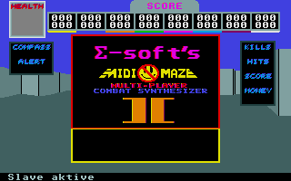
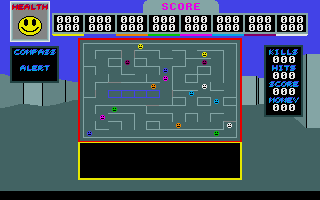
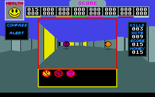
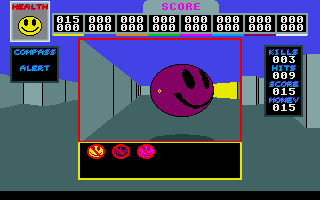

# Midi-Maze II

Midi-Maze was one of the first first-person shooter for up to 16 players, long before Wolfenstein 3D, Doom, etc. Midi-Maze II was the sucessor which adds much more reliably, features and fun to the game.

  * [MIDIMAZE.LZH](MIDIMAZE.LZH) (384kb, the game of the game - shareware version)
  * [MAZEPOOL.LZH](MAZEPOOL.LZH) (480kb, only for registered users)
  * [Midi-Maze2.zip](Midi-Maze2.zip) (440kb, original disk image of the release version - without serial number!)
  * [Midi_Maze_2.image.zip](Midi_Maze_2.image.zip) (416kb, Macintosh DiskCopy image of the release version, also without serial number!)

Some links to MidiMaze related websites:

- <http://www.midimaze.de> MidiMaze Fans from its homeland.
- <http://midimaze.atari.org> Adding to MidiMaze II even today.
- [MidiMaze Utilities Set](http://www.esglabs.com/midimaze/) of patches for MidiMaze
